# Documento de Arquitetura de Software — ERP + PDV

| Campo | Valor |
|---|---|
| **Projeto** | ERP + PDV para pequenas empresas brasileiras |
| **Versão do documento** | 1.2 |
| **Status** | Proposta para aprovação |
| **Data** | 30/07/2026 |
| **Autor** | Arquitetura / Liderança Técnica |
| **Revisão conjunta** | Arquiteto · Dev Sênior · UX/UI · DBA PostgreSQL · Segurança · Fiscal BR · Negócios · QA · DevOps (ver `CLAUDE.md` §1) |
| **Público-alvo** | Time de desenvolvimento, QA, suporte, stakeholders |
| **Escopo** | Arquitetura completa. Nenhuma implementação nesta etapa. |

### Histórico de revisões

| Versão | Data | Mudança |
|---|---|---|
| 1.0 | 30/07/2026 | Versão inicial |
| **1.1** | 30/07/2026 | **ADR-0002 superseado pelo ADR-0013**: banco passa de SQLite (padrão) para **PostgreSQL único embarcado**. Impacta §1.5, §1.7, §2.2, §2.5, §2.7, §5.1, §5.2.1, §7.1, §10, §12, §13.4 e §16.2. RPO melhora de 15 min para próximo de zero via PITR. |

---

## Sumário

1. [Visão geral do sistema](#1-visão-geral-do-sistema)
2. [Arquitetura completa](#2-arquitetura-completa)
3. [Organização do monorepo](#3-organização-do-monorepo)
4. [Estrutura de pastas](#4-estrutura-de-pastas)
5. [Tecnologias escolhidas e justificativa](#5-tecnologias-escolhidas-e-justificativa)
6. [Padrões de projeto utilizados](#6-padrões-de-projeto-utilizados)
7. [Estratégia de segurança](#7-estratégia-de-segurança)
8. [Estratégia de autenticação](#8-estratégia-de-autenticação)
9. [Estratégia de permissões](#9-estratégia-de-permissões)
10. [Estratégia de backup](#10-estratégia-de-backup)
11. [Estratégia de sincronização](#11-estratégia-de-sincronização)
12. [Estratégia para funcionamento offline](#12-estratégia-para-funcionamento-offline)
13. [Estratégia de atualização](#13-estratégia-de-atualização)
14. [Estratégia para impressão](#14-estratégia-para-impressão)
15. [Estratégia para emissão fiscal](#15-estratégia-para-emissão-fiscal)
16. [Estratégia para crescimento futuro](#16-estratégia-para-crescimento-futuro)
17. [Roadmap de implementação](#17-roadmap-de-implementação)
18. [Registro de decisões arquiteturais (ADR)](#18-registro-de-decisões-arquiteturais-adr)
19. [Glossário](#19-glossário)

---

## 1. Visão geral do sistema

### 1.1 Problema

Pequenas empresas brasileiras — mercearias, lojas de roupa, papelarias, lanchonetes, pet shops, autopeças — operam hoje com três opções ruins:

| Opção | Problema real |
|---|---|
| Sistema legado desktop (anos 2000) | Interface hostil, exige treinamento longo, travar é rotina, suporte caro |
| SaaS 100% cloud | **Internet caiu, loja parou.** Mensalidade recorrente pesada, dados reféns |
| Planilha + bloco de papel | Sem controle fiscal, sem estoque confiável, sem histórico |

O ponto crítico e inegociável é este: **um PDV não pode parar.** Se o caixa não registra venda, a empresa fecha as portas naquele instante. Toda decisão neste documento é subordinada a essa premissa.

### 1.2 Proposta de valor

Um sistema que:

- **Funciona sem internet.** A internet é necessária apenas para autorizar documentos fiscais — e mesmo isso tem contingência legal prevista.
- **É rápido no balcão.** Operação inteira por teclado e leitor de código de barras, sem mouse. Meta: venda de 5 itens registrada e finalizada em menos de 20 segundos.
- **Instala em minutos.** Um instalador, sem DBA, sem servidor de aplicação, sem configuração de rede complexa.
- **É fiscalmente correto.** NFC-e, NF-e, contingência, e preparado para a Reforma Tributária (CBS/IBS) que já está em ano-teste.
- **Cresce sem reescrita.** A mesma base de código atende 1 caixa hoje e 10 lojas daqui a três anos.

### 1.3 Perfil de uso (dimensionamento)

| Parâmetro | Valor de projeto |
|---|---|
| Estações simultâneas | 1 a 3 (arquitetura suporta até 8 sem mudança) |
| Vendas por dia | até 2.000 |
| Itens por venda (médio) | 4 |
| Catálogo de produtos | até 50.000 SKUs |
| Clientes cadastrados | até 100.000 |
| Retenção de dados fiscais | 5 anos (exigência legal) |
| Volume de banco em 5 anos | ~4 GB (estimativa) |

Esse volume é **pequeno** para padrões de engenharia moderna. Reconhecer isso é fundamental: dimensionar para escala que não existe é a causa número um de complexidade desnecessária e de retrabalho. A arquitetura abaixo é deliberadamente simples no núcleo e extensível nas bordas.

### 1.4 Módulos funcionais (escopo do produto)

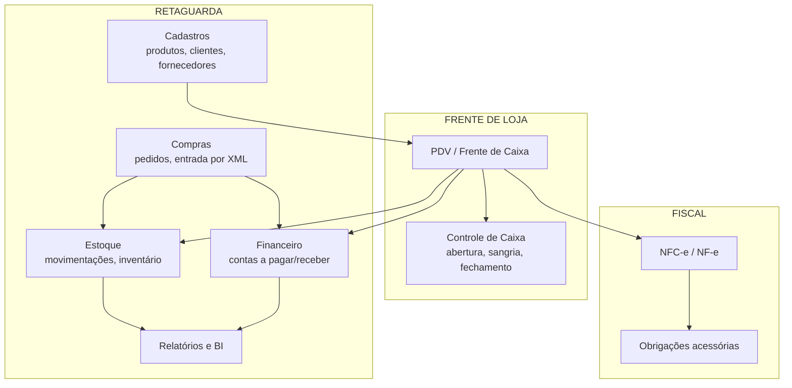

**Fase 1 (MVP comercializável):** Cadastros, Estoque, PDV, Caixa, NFC-e, Relatórios essenciais.
**Fase 2:** Compras com entrada por XML, Financeiro, NF-e.
**Fase 3:** BI, multi-loja, integrações (e-commerce, marketplace, TEF).

### 1.5 Requisitos não-funcionais (com metas mensuráveis)

Requisito sem número é opinião. Estas são as metas que o sistema deve cumprir e que serão verificadas em testes automatizados de performance:

| # | Requisito | Meta | Como medimos |
|---|---|---|---|
| RNF-01 | Abertura da tela de PDV | < 2 s (frio), < 500 ms (quente) | Teste E2E cronometrado |
| RNF-02 | Busca de produto por código de barras | **< 100 ms (p95)** com 50k SKUs | Benchmark com base sintética |
| RNF-03 | Inclusão de item no carrinho | < 50 ms, sem ida ao servidor | Medição no cliente |
| RNF-04 | Finalização de venda (sem fiscal) | < 300 ms (p95) | Benchmark de integração |
| RNF-05 | Autorização de NFC-e online | < 3 s (p95) | Métrica de produção |
| RNF-06 | Disponibilidade do PDV | **99,9%, independente de internet** | Telemetria de indisponibilidade |
| RNF-07 | Perda máxima de dados (RPO) | **próximo de zero** (PITR) | Teste de restauração |
| RNF-08 | Tempo de recuperação (RTO) | 30 minutos | Simulação de desastre |
| RNF-09 | Instalação completa | < 10 minutos, por não-técnico | Teste com usuário real |
| RNF-10 | Consumo de RAM da estação PDV | < 500 MB | Profiling |
| RNF-11 | Cobertura de testes no domínio | ≥ 90% | CI |
| RNF-12 | Nenhuma dependência com vulnerabilidade alta/crítica | 0 | `npm audit` no CI |

### 1.6 Premissas e restrições

**Premissas:**
- A empresa possui uma máquina que pode ficar ligada durante o expediente (o "servidor da loja"). Pode ser o próprio computador do escritório.
- Existe rede local (cabeada ou Wi-Fi) entre as máquinas.
- A empresa possui ou providenciará certificado digital A1 e CSC para emissão fiscal.

**Restrições:**
- Hardware modesto: 4 GB RAM, processador de entrada, HD mecânico em parte da base instalada.
- Windows 10/11 é o sistema operacional dominante neste público. Linux é objetivo secundário.
- Usuário final sem conhecimento técnico. Qualquer erro que exija linha de comando é uma falha de produto.

### 1.7 Riscos arquiteturais e mitigação

| Risco | Impacto | Prob. | Mitigação |
|---|---|---|---|
| Servidor da loja falha (HD, energia) | **Crítico** — loja para | Média | Modo contingência local no PDV (§12) + backup automático (§10) |
| Mudança de layout fiscal pela SEFAZ | Alto — bloqueia emissão | **Alta** (Reforma Tributária) | Camada fiscal isolada por adapter (§15); versionamento de layout |
| Reforma Tributária (CBS/IBS/IS) | Alto — remodelagem tributária | **Certa** | Modelo de dados já contempla os grupos novos (§15.7) |
| Divergência de estoque entre estações | Alto — perda financeira | Média | Estoque como *event sourcing* comutativo (§11.4) |
| Corrupção do banco por queda de energia | **Crítico** | Média | PostgreSQL WAL + `full_page_writes` + `synchronous_commit=on` + nobreak recomendado |
| Complexidade acidental do time | Médio — atrasa entregas | Média | Arquitetura em camadas com fronteiras explícitas no CI |

---

## 2. Arquitetura completa

### 2.1 Princípios norteadores

Sete princípios que resolvem qualquer discussão de design neste projeto:

1. **O PDV nunca para.** Se uma funcionalidade pode impedir uma venda, ela precisa de caminho degradado.
2. **O domínio não conhece infraestrutura.** Regras de negócio não importam Prisma, HTTP, React ou `fs`.
3. **Dependências apontam para dentro.** UI → Aplicação → Domínio. Nunca o contrário.
4. **Dinheiro é inteiro.** Centavos, sempre. `float` para dinheiro é bug esperando o fechamento de caixa.
5. **Fatos são imutáveis.** Estoque, caixa e fiscal são registrados como eventos append-only. Correção gera novo evento, nunca `UPDATE`.
6. **Simples por padrão, extensível por contrato.** Nada de abstração especulativa; abstração só onde já existe uma segunda implementação prevista (fiscal, impressão, pagamento).
7. **Erros são valores, não exceções.** Falhas de negócio previsíveis retornam `Result`, não `throw`.

### 2.2 Topologia física (C4 — Nível 2: Contêineres)

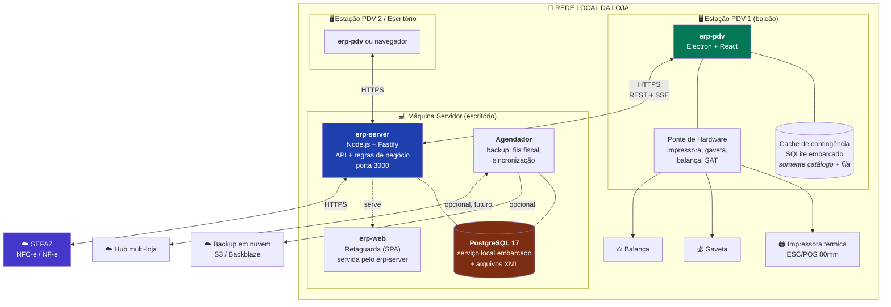

**Decisão central: servidor local único, clientes com contingência.**

Foram avaliadas três topologias:

| Topologia | Prós | Contras | Veredito |
|---|---|---|---|
| **A. Cloud puro** | Zero manutenção local, multi-loja nativo | **Internet cai, loja para.** Mensalidade. Latência no balcão | ❌ Viola o princípio 1 |
| **B. Servidor local + clientes finos** | Simples, consistência forte, um único banco | Servidor cai, tudo para | ⚠️ Quase |
| **C. Banco replicado em cada estação** | Máxima resiliência | Sincronização bidirecional complexa, conflitos, custo de manutenção altíssimo para 3 máquinas | ❌ Complexidade desproporcional |

**Escolhida: B + contingência local (B⁺).** O servidor local é a fonte da verdade. Cada estação PDV mantém uma **réplica somente-leitura do catálogo** e uma **fila local de vendas**. Se o servidor cair, o PDV continua vendendo contra a réplica e drena a fila quando o servidor voltar (§12).

Isso entrega ~95% da resiliência da opção C com ~20% da complexidade — o que é a decisão correta para 1 a 3 estações. A opção C permanece possível no futuro porque o modelo de dados já é baseado em eventos e IDs distribuídos (§11).

### 2.3 Arquitetura lógica — Hexagonal (Ports & Adapters)

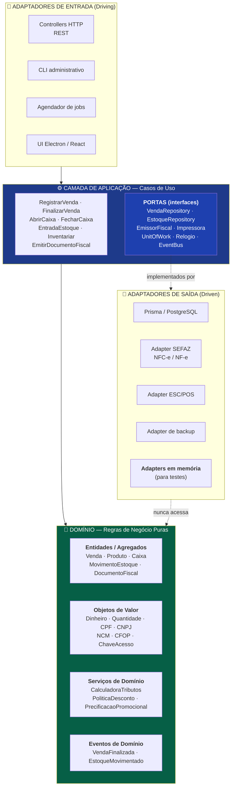

**Regra de ouro, verificada automaticamente no CI:** o pacote `@erp/domain` tem **zero dependências de runtime**. Nenhum import de Prisma, HTTP, React, `fs` ou biblioteca de terceiros. Um teste de arquitetura (`dependency-cruiser`) quebra o build se alguém violar.

**Por que isso importa comercialmente, não só academicamente:**

| Mudança futura | Sem hexagonal | Com hexagonal |
|---|---|---|
| Migrar para Postgres gerenciado na nuvem | Reescrita de queries espalhadas | Trocar string de conexão |
| Adicionar SAT (São Paulo) | `if` no meio do PDV | Novo adapter `EmissorFiscal` |
| Expor API para app mobile | Duplicar regras | Novo adapter de entrada |
| Testar regra de troco | Subir banco e servidor | Teste unitário puro, milissegundos |

### 2.4 Fluxo completo de uma venda (diagrama de sequência)

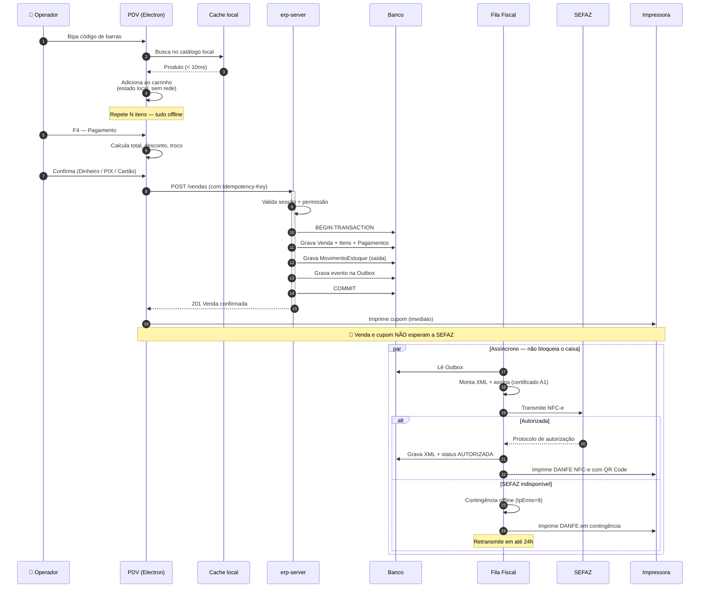

**O ponto arquitetural mais importante deste diagrama:** a venda é confirmada e o cupom sai **antes** de qualquer interação com a SEFAZ. A emissão fiscal é assíncrona, via fila. Se a SEFAZ estiver fora do ar — o que acontece com frequência real no Brasil —, a fila entra em contingência e o caixa nunca percebe. Sistemas que acoplam a venda à autorização fiscal travam a loja quando a SEFAZ cai; esse é um erro de arquitetura comum e caro.

### 2.5 Modelo de domínio (visão macro)

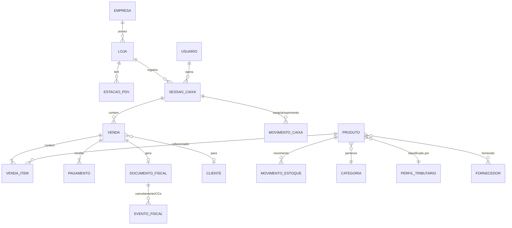

**Agregados (fronteiras de consistência transacional):**

| Agregado | Raiz | Invariante que protege |
|---|---|---|
| **Venda** | `Venda` | Total = soma dos itens − desconto; pagamentos ≥ total; venda finalizada é imutável |
| **Caixa** | `SessaoCaixa` | Só uma sessão aberta por estação; fechamento confere saldo por forma de pagamento |
| **Estoque** | `Produto` | Saldo = soma dos movimentos; venda não pode gerar saldo negativo (configurável) |
| **DocumentoFiscal** | `DocumentoFiscal` | Máquina de estados fiscal; numeração sequencial sem lacuna por série |

Transações **nunca** cruzam agregados. Comunicação entre agregados é via **eventos de domínio** — o que mantém as transações curtas (reduzindo contenção de lock e tempo de bloat no MVCC do PostgreSQL) e prepara o caminho para distribuição futura.

### 2.6 Contratos de comunicação

| Interface | Protocolo | Justificativa |
|---|---|---|
| PDV ↔ servidor | **REST/JSON sobre HTTPS** | Simples, depurável, cacheável, funciona em qualquer cliente |
| Notificações servidor → PDV | **SSE (Server-Sent Events)** | Unidirecional basta (preço alterado, produto novo); muito mais simples que WebSocket |
| Retaguarda ↔ servidor | REST/JSON | Mesma API — sem duplicação de regra |
| Servidor ↔ SEFAZ | SOAP/XML + TLS mútuo | Imposto pela SEFAZ |
| PDV ↔ hardware | IPC Electron → biblioteca nativa | Navegador não acessa porta serial/USB de forma confiável |

**Contratos são definidos uma vez em `@erp/contracts` com Zod** e derivam: tipos TypeScript, validação em runtime no servidor, validação no cliente e documentação OpenAPI. Uma fonte de verdade — impossível o cliente e o servidor divergirem sem quebrar a compilação.

### 2.7 Decisões arquiteturais chave (resumo)

| # | Decisão | Alternativa rejeitada | Motivo |
|---|---|---|---|
| 1 | Servidor local + contingência | Cloud puro | PDV não pode depender de internet |
| 2 | **PostgreSQL único, embarcado no instalador** | SQLite padrão com Postgres opcional | Um só banco em dev, teste e produção; elimina migration dupla e divergência teste↔produção; sem migração futura por cliente |
| 3 | Monorepo | Multi-repo | Contratos compartilhados, refatoração atômica, um CI |
| 4 | Hexagonal | MVC em camadas | Domínio testável e fiscal/hardware plugáveis |
| 5 | Electron no PDV | Navegador puro | Acesso a impressora, gaveta, balança, SAT e auto-update |
| 6 | Emissão fiscal assíncrona | Síncrona na venda | SEFAZ instável não pode travar o caixa |
| 7 | Estoque como eventos | Coluna `saldo` mutável | Auditabilidade + convergência na sincronização |
| 8 | UUIDv7 como ID | Auto-incremento | Geração offline sem colisão; ordenável por tempo |
| 9 | Dinheiro em centavos (`bigint`) | `float` / `Decimal` | Exatidão absoluta; sem dependência de driver |

---

## 3. Organização do monorepo

### 3.1 Por que monorepo

Este produto tem **quatro artefatos executáveis** (servidor, PDV, retaguarda, CLI) que compartilham **um único domínio de negócio**. Multi-repo aqui significaria publicar pacotes internos a cada mudança de regra — atrito diário sem benefício.

| Critério | Monorepo | Multi-repo |
|---|---|---|
| Mudar regra de cálculo de troco | 1 PR atômico | 3 PRs + versionamento + sincronização |
| Contratos API sempre consistentes | Garantido pelo compilador | Depende de disciplina |
| Onboarding de desenvolvedor | `git clone` + `pnpm install` | Clonar N repositórios |
| CI | Um pipeline com cache incremental | N pipelines |
| Risco | Build lento se mal configurado | Inferno de versionamento |

O único risco real (build lento) é resolvido por **Turborepo com cache incremental**: só reconstrói o que mudou e o que depende do que mudou.

### 3.2 Gerenciador de pacotes: pnpm workspaces

**pnpm**, não npm nem yarn:
- **Isolamento estrito** — um pacote só importa o que declarou. Isso *impede fisicamente* violação de camadas, que é exatamente a garantia que a arquitetura hexagonal precisa.
- Instalação 2–3× mais rápida e ~70% menos disco (store com hard links).
- Suporte a workspaces maduro e `pnpm-workspace.yaml` explícito.

### 3.3 Grafo de dependências entre pacotes

O grafo abaixo é **lei**. Qualquer seta que não exista aqui é proibida e quebra o CI.

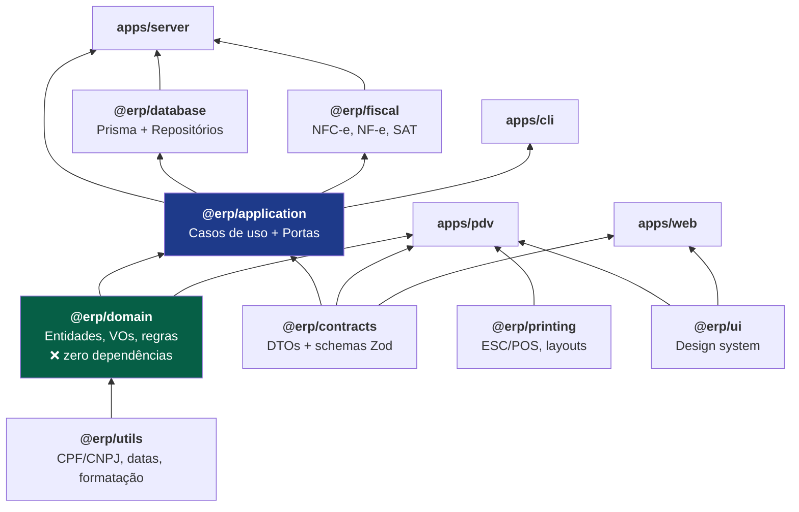

**Leitura das regras críticas:**
- `@erp/domain` não depende de **nada** (exceto `@erp/utils`, que também é puro).
- `@erp/database` e `@erp/fiscal` implementam portas de `@erp/application` — a seta aponta para dentro.
- `apps/pdv` importa `@erp/domain` para calcular carrinho **localmente** (sem servidor) — é isso que permite o modo offline.
- Nenhum `app` importa outro `app`.

### 3.4 Descrição de cada pacote

| Pacote | Responsabilidade | Não pode conter |
|---|---|---|
| `@erp/domain` | Entidades, agregados, objetos de valor, serviços e eventos de domínio. Regra pura. | I/O, framework, `async` de infraestrutura |
| `@erp/application` | Casos de uso (orquestração) e definição das **portas** | SQL, HTTP, detalhes de biblioteca |
| `@erp/contracts` | DTOs, schemas Zod, tipos de request/response, códigos de erro | Lógica de negócio |
| `@erp/database` | Schema Prisma, migrations, implementação dos repositórios, Unit of Work | Regra de negócio |
| `@erp/fiscal` | Geração/assinatura/transmissão de XML, adapters SEFAZ/SAT, cálculo tributário aplicado | Acesso a banco |
| `@erp/printing` | Comandos ESC/POS, layouts de cupom/DANFE, descoberta de impressoras | Regra de negócio |
| `@erp/ui` | Design system: componentes, tokens, temas, acessibilidade | Chamadas de API |
| `@erp/utils` | Validadores (CPF/CNPJ/IE), formatadores, datas, `Result`, ULID/UUIDv7 | Qualquer dependência do projeto |
| `@erp/config` | Configurações compartilhadas de TS, ESLint, Prettier, Vitest | — |
| `apps/server` | Composição: HTTP, injeção de dependências, jobs, autenticação | Regra de negócio nova |
| `apps/pdv` | Frente de caixa Electron + React | Acesso direto ao banco do servidor |
| `apps/web` | Retaguarda SPA | Regra de negócio nova |
| `apps/cli` | Administração: backup, restauração, diagnóstico, migração | — |

---

## 4. Estrutura de pastas

### 4.1 Raiz do monorepo

```
erp-pdv/
├── .github/
│   └── workflows/
│       ├── ci.yml                    # lint, typecheck, testes, audit, arquitetura
│       ├── release.yml               # build de instaladores + assinatura
│       └── security.yml              # varredura de dependências e segredos
├── apps/
│   ├── server/                       # API + regras (Node.js)
│   ├── pdv/                          # Frente de caixa (Electron + React)
│   ├── web/                          # Retaguarda (React SPA)
│   └── cli/                          # Ferramenta administrativa
├── packages/
│   ├── domain/                       # 💎 núcleo puro
│   ├── application/                  # casos de uso + portas
│   ├── contracts/                    # DTOs + Zod + OpenAPI
│   ├── database/                     # Prisma + repositórios
│   ├── fiscal/                       # NFC-e / NF-e / SAT
│   ├── printing/                     # ESC/POS
│   ├── ui/                           # design system
│   ├── utils/                        # utilitários puros
│   └── config/                       # tsconfig / eslint / vitest base
├── docs/
│   ├── ARQUITETURA.md                # este documento
│   ├── adr/                          # decisões arquiteturais numeradas
│   ├── fiscal/                       # notas técnicas, layouts, tabelas
│   ├── operacao/                     # instalação, backup, suporte
│   └── manual/                       # manual do usuário final
├── tooling/
│   ├── installers/                   # NSIS (Windows), .deb (Linux)
│   ├── scripts/                      # automações de desenvolvimento
│   └── fixtures/                     # massa de teste
├── pnpm-workspace.yaml
├── turbo.json
├── package.json
├── .dependency-cruiser.cjs           # regras de arquitetura verificadas no CI
└── README.md
```

### 4.2 `packages/domain` — o núcleo

Organizado por **contexto de negócio**, não por tipo técnico. Isso mantém coeso o que muda junto.

```
packages/domain/src/
├── shared/
│   ├── Entity.ts                     # identidade + igualdade
│   ├── AggregateRoot.ts              # raiz + coleta de eventos
│   ├── ValueObject.ts                # imutabilidade + igualdade estrutural
│   ├── DomainEvent.ts
│   ├── Result.ts                     # Result<T, E> — erros como valores
│   └── DomainError.ts                # hierarquia de erros de negócio
│
├── valores/                          # Objetos de valor transversais
│   ├── Dinheiro.ts                   # centavos (bigint), aritmética segura, rateio
│   ├── Quantidade.ts                 # 3 casas decimais, unidade (UN/KG/L/CX)
│   ├── Percentual.ts
│   ├── CPF.ts  ├── CNPJ.ts  ├── InscricaoEstadual.ts
│   ├── Email.ts  ├── Telefone.ts  ├── CEP.ts
│   └── Periodo.ts
│
├── catalogo/                         # ── Contexto: Catálogo ──
│   ├── Produto.ts                    # agregado
│   ├── Categoria.ts
│   ├── CodigoBarras.ts               # EAN-13/8, DUN-14, código de balança
│   ├── UnidadeMedida.ts
│   ├── PrecificacaoService.ts        # markup, margem, promoção
│   └── eventos/PrecoAlterado.ts
│
├── estoque/                          # ── Contexto: Estoque ──
│   ├── MovimentoEstoque.ts           # ENTRADA | SAIDA | AJUSTE | PERDA | TRANSFERENCIA
│   ├── SaldoEstoque.ts               # projeção calculada a partir dos movimentos
│   ├── Inventario.ts
│   ├── CustoMedioService.ts          # custo médio ponderado móvel
│   └── eventos/EstoqueMovimentado.ts
│
├── vendas/                           # ── Contexto: Vendas ──
│   ├── Venda.ts                      # 🔑 agregado principal
│   ├── VendaItem.ts
│   ├── Pagamento.ts
│   ├── FormaPagamento.ts             # DINHEIRO | PIX | DEBITO | CREDITO | ...
│   ├── PoliticaDesconto.ts           # limites por papel de usuário
│   ├── CalculadoraTroco.ts
│   └── eventos/VendaFinalizada.ts
│
├── caixa/                            # ── Contexto: Caixa ──
│   ├── SessaoCaixa.ts                # agregado
│   ├── MovimentoCaixa.ts             # sangria | suprimento
│   ├── ConferenciaCaixa.ts           # esperado vs. contado, divergência
│   └── eventos/CaixaFechado.ts
│
├── fiscal/                           # ── Contexto: Fiscal (regras puras) ──
│   ├── DocumentoFiscal.ts            # agregado + máquina de estados
│   ├── ChaveAcesso.ts                # 44 dígitos + dígito verificador
│   ├── NCM.ts  ├── CEST.ts  ├── CFOP.ts
│   ├── CST.ts  ├── CSOSN.ts  ├── OrigemMercadoria.ts
│   ├── RegimeTributario.ts           # Simples | Presumido | Real
│   ├── PerfilTributario.ts           # agrupa a tributação de um produto
│   ├── CalculadoraTributos.ts        # ICMS, ST, IPI, PIS, COFINS, FCP
│   ├── CalculadoraReformaTributaria.ts  # CBS, IBS, IS
│   └── SerieNumeracao.ts             # sequencial sem lacuna, por série
│
├── pessoas/                          # ── Contexto: Pessoas ──
│   ├── Cliente.ts  ├── Fornecedor.ts  ├── Endereco.ts
│
└── acesso/                           # ── Contexto: Identidade ──
    ├── Usuario.ts  ├── Papel.ts  ├── Permissao.ts  └── PoliticaAcesso.ts
```

### 4.3 `packages/application` — casos de uso e portas

```
packages/application/src/
├── portas/                           # 🔌 interfaces que a infraestrutura implementa
│   ├── repositorios/
│   │   ├── ProdutoRepository.ts
│   │   ├── VendaRepository.ts
│   │   ├── EstoqueRepository.ts
│   │   ├── CaixaRepository.ts
│   │   └── DocumentoFiscalRepository.ts
│   ├── servicos/
│   │   ├── EmissorFiscal.ts          # 🔑 porta trocável: NFC-e | NF-e | SAT | Nulo
│   │   ├── ServicoImpressao.ts       # 🔑 porta trocável: ESC/POS | PDF | Nulo
│   │   ├── ProvedorPagamento.ts      # futuro: TEF / PIX dinâmico
│   │   ├── ServicoBackup.ts
│   │   └── Notificador.ts
│   └── infraestrutura/
│       ├── UnitOfWork.ts             # transação atômica entre repositórios
│       ├── Relogio.ts                # ⏱️ tempo injetável (testes determinísticos)
│       ├── GeradorId.ts
│       ├── EventBus.ts
│       └── Logger.ts
│
├── casos-de-uso/
│   ├── vendas/
│   │   ├── IniciarVenda.ts
│   │   ├── AdicionarItem.ts
│   │   ├── AplicarDesconto.ts
│   │   ├── RegistrarPagamento.ts
│   │   ├── FinalizarVenda.ts         # 🔑 orquestra: estoque + caixa + outbox fiscal
│   │   └── CancelarVenda.ts          # estorna estoque + evento fiscal
│   ├── caixa/          # AbrirCaixa, Sangria, Suprimento, FecharCaixa
│   ├── estoque/        # RegistrarEntrada, Ajustar, Inventariar, ImportarXmlCompra
│   ├── catalogo/       # CriarProduto, AtualizarPreco, ReajustarEmLote
│   ├── fiscal/         # EmitirDocumento, CancelarDocumento, Inutilizar, ProcessarFila
│   └── relatorios/     # VendasPorPeriodo, CurvaABC, GiroEstoque, DRE
│
├── manipuladores-evento/             # reações a eventos de domínio
│   ├── AoFinalizarVenda.EnfileirarFiscal.ts
│   ├── AoFinalizarVenda.AtualizarProjecoes.ts
│   └── AoFecharCaixa.DispararBackup.ts
│
└── decoradores/                      # cross-cutting sem poluir o caso de uso
    ├── ComTransacao.ts
    ├── ComAuditoria.ts
    ├── ComAutorizacao.ts
    └── ComIdempotencia.ts
```

### 4.4 `apps/server`

```
apps/server/src/
├── main.ts                           # bootstrap
├── composicao/
│   ├── container.ts                  # 🔑 injeção de dependências — onde portas viram adapters
│   └── ambiente.ts                   # config validada por Zod (falha rápido)
├── http/
│   ├── servidor.ts                   # Fastify
│   ├── rotas/                        # vendas, produtos, estoque, caixa, fiscal, auth
│   ├── middleware/                   # autenticacao, autorizacao, idempotencia,
│   │                                 # rate-limit, tratamento-erro, correlacao
│   └── apresentadores/               # domínio → DTO (nunca vaza entidade)
├── sse/                              # canal de eventos para os PDVs
├── jobs/
│   ├── agendador.ts
│   ├── ProcessarFilaFiscal.job.ts    # a cada 30 s
│   ├── Backup.job.ts                 # de hora em hora + no fechamento
│   ├── RetransmitirContingencia.job.ts
│   └── ManutencaoBanco.job.ts        # VACUUM/ANALYZE, reindex, monitor de bloat
└── seguranca/                        # sessoes, cofre de certificado, auditoria
```

### 4.5 `apps/pdv` (Electron)

```
apps/pdv/src/
├── principal/                        # processo main do Electron (Node.js)
│   ├── main.ts
│   ├── janela.ts                     # tela cheia, sem barra, kiosk
│   ├── ponte-hardware/               # 🔑 o que o navegador não faz
│   │   ├── impressora.ts             # USB / rede / serial
│   │   ├── gaveta.ts
│   │   ├── balanca.ts                # protocolos Toledo / Filizola
│   │   ├── leitor.ts                 # HID (emula teclado)
│   │   └── sat.ts                    # DLL do equipamento SAT (SP)
│   ├── armazenamento-local/
│   │   ├── replica-catalogo.ts       # SQLite embarcado — busca offline
│   │   └── fila-vendas.ts            # 🔑 vendas pendentes de sincronização
│   ├── sincronizacao/
│   │   ├── sincronizador.ts
│   │   └── detector-conectividade.ts
│   └── atualizador.ts                # auto-update assinado
├── ponte/preload.ts                  # API segura (contextIsolation)
└── renderizador/                     # React
    ├── telas/
    │   ├── Venda/                    # 🔑 tela principal
    │   │   ├── TelaVenda.tsx
    │   │   ├── BuscaProduto.tsx
    │   │   ├── Carrinho.tsx
    │   │   ├── PainelTotais.tsx
    │   │   └── ModalPagamento.tsx
    │   ├── AberturaCaixa/  FechamentoCaixa/  Consulta/
    ├── atalhos/
    │   └── mapa-teclas.ts            # 🔑 F1..F12 — operação sem mouse
    ├── estado/                       # carrinho, sessão, conectividade
    └── offline/indicador-status.tsx
```

### 4.6 `packages/fiscal`

```
packages/fiscal/src/
├── adapters/
│   ├── NuloEmissor.ts                # cupom não fiscal — MVP e desenvolvimento
│   ├── NFCeEmissor.ts                # modelo 65
│   ├── NFeEmissor.ts                 # modelo 55
│   ├── SATEmissor.ts                 # CF-e-SAT (São Paulo)
│   └── HomologacaoEmissor.ts         # ambiente de testes SEFAZ
├── xml/
│   ├── construtores/                 # geração por versão de layout
│   ├── assinatura/                   # XMLDSig com certificado A1
│   ├── validacao/                    # XSD oficiais
│   └── schemas/                      # XSDs versionados
├── transmissao/
│   ├── cliente-sefaz.ts              # SOAP + TLS mútuo
│   ├── endpoints-por-uf.ts           # 27 UFs + SVC-AN / SVC-RS
│   ├── politica-retentativa.ts       # backoff exponencial
│   └── monitor-status-servico.ts     # consulta status antes de transmitir
├── contingencia/
│   ├── gerenciador-contingencia.ts   # entra/sai de contingência automaticamente
│   └── fila-retransmissao.ts         # prazo legal de 24 h
├── certificado/
│   ├── cofre-certificado.ts          # A1 criptografado em repouso
│   └── monitor-validade.ts           # alerta 30/15/7 dias antes de vencer
├── tributacao/
│   ├── motor-tributario.ts
│   ├── regras/                       # por regime e por UF
│   └── tabelas/                      # NCM, CEST, CFOP, IBPT
└── obrigacoes/                       # SPED, EFD, Sintegra (futuro)
```

### 4.7 Convenções de nomenclatura

| Elemento | Convenção | Exemplo |
|---|---|---|
| Domínio (arquivos e conceitos) | **Português** | `Venda.ts`, `CalculadoraTributos.ts` |
| Infraestrutura técnica | Inglês onde é jargão | `Repository`, `UnitOfWork` |
| Classes / tipos | `PascalCase` | `SessaoCaixa` |
| Funções / variáveis | `camelCase` | `calcularTroco` |
| Pastas | `kebab-case` | `casos-de-uso/` |
| Tabelas do banco | `snake_case` plural | `venda_itens` |
| Rotas HTTP | `kebab-case` plural | `/api/movimentos-estoque` |

**O domínio é escrito em português.** O negócio é brasileiro, a legislação é em português, e não existe tradução honesta para "sangria de caixa", "CSOSN" ou "inutilização de numeração". Traduzir o domínio cria uma camada permanente de tradução mental que gera bug. Infraestrutura, por ser jargão universal de engenharia, permanece em inglês.

---

## 5. Tecnologias escolhidas e justificativa

### 5.1 Quadro geral

| Camada | Escolha | Versão | Alternativa considerada | Por que esta |
|---|---|---|---|---|
| Linguagem | **TypeScript** (strict) | 5.9+ | C#, Java, Go | Uma linguagem do banco à UI; tipagem forte pega erro fiscal em compilação; mercado de devs amplo |
| Runtime | **Node.js LTS** | 22 LTS | Bun, Deno | Estabilidade e ecossistema de bibliotecas fiscais/hardware |
| API | **Fastify** | 5.x | Express, NestJS | 2× mais rápido que Express; validação por schema nativa; NestJS traz peso desnecessário |
| ORM | **Prisma** | 6.x | Drizzle, TypeORM | Migrations confiáveis, tipagem excelente, `migrate diff` para reversão |
| **Banco** | **PostgreSQL** (embarcado) | 17 | SQLite, Firebird | Único banco em dev/teste/produção; integridade, MVCC, PITR, roles |
| Cache local do PDV | **SQLite** (embarcado no Electron) | 3.4x | IndexedDB | Apenas catálogo replicado + fila offline — **não** é sistema de registro |
| UI | **React** | 19 | Vue, Svelte | Maior ecossistema; contratação mais fácil |
| Build do front | **Vite** | 7.x | Webpack, Next.js | Rápido; SPA é o que o produto precisa (SEO é irrelevante) |
| Estilo | **Tailwind CSS** | 4.x | CSS Modules | Consistência via tokens; sem CSS órfão |
| Estado servidor | **TanStack Query** | 5.x | Redux | Cache, revalidação e offline nativos |
| Estado local | **Zustand** | 5.x | Redux Toolkit | Mínimo necessário para o carrinho |
| Desktop | **Electron** | 3x LTS | Tauri, PWA | Acesso maduro a impressora/serial/SAT; auto-update consolidado |
| Validação | **Zod** | 4.x | Yup, Joi | Schema → tipo → validação, fonte única |
| Testes | **Vitest** + **Playwright** | — | Jest + Cypress | Mais rápido; mesma config do Vite |
| Monorepo | **pnpm + Turborepo** | — | Nx, Lerna | Isolamento estrito + cache incremental |
| Logs | **Pino** | 9.x | Winston | JSON estruturado, altíssimo desempenho |
| Instalador | **NSIS** / **electron-builder** | — | MSI | Padrão do público-alvo Windows |

### 5.2 Justificativas das escolhas polêmicas

#### 5.2.1 PostgreSQL único e embarcado — a decisão de maior impacto

> **Nota de revisão.** A versão 1.0 deste documento recomendava SQLite como padrão, com
> PostgreSQL como caminho de crescimento. Essa recomendação foi **revista e substituída**
> após a revisão conjunta com o DBA, o QA e o DevOps. O ADR-0002 foi superseado pelo
> ADR-0013. O raciocínio original está preservado abaixo, junto com o motivo da mudança.

**O argumento original a favor do SQLite continua tecnicamente correto** — e é importante
reconhecer isso, porque a decisão não mudou por erro de cálculo:

| Fato | Consequência |
|---|---|
| 2.000 vendas/dia = **~0,03 escritas/segundo** de pico real | SQLite entregaria isso com folga |
| Base projetada em 5 anos: ~4 GB | Muito abaixo do limite do SQLite |
| 1 a 3 clientes concorrentes | Escrita serializada seria irrelevante nesse volume |

**O que mudou:** o critério de decisão. A pergunta certa não é *"SQLite aguenta a carga?"*
(aguenta), mas *"qual banco entrega o menor custo total ao longo da vida de um produto
comercial vendido para muitos clientes?"*. Com essa pergunta, o quadro se inverte:

| Papel | Objeção ao SQLite | Peso |
|---|---|---|
| **QA** | Testar em SQLite e vender em Postgres significa que a suíte **não exercita o banco de produção**. Diferenças de tipo, `NULL` em índice único, ordenação e nível de isolamento produzem bug que só aparece no cliente | 🔴 Bloqueante |
| **DevOps** | Dois bancos = duas históricas de migration no Prisma, matriz dupla de CI e **drift permanente** entre elas | 🔴 Bloqueante |
| **DBA** | Sem roles, sem PITR, sem `EXPLAIN` decente, sem tipos ricos, `ALTER TABLE` limitado (o Prisma reconstrói a tabela inteira — arriscado em base grande) | 🔴 Bloqueante |
| **Segurança** | Arquivo único, copiável inteiro por qualquer processo com acesso ao disco. Postgres tem separação real de usuários e permissões por objeto | 🟠 Alto |
| **Negócios** | Migrar depois custa **por cliente**, multiplicado pela base instalada, e cada migração é uma janela de risco de perda de dados | 🔴 Bloqueante |

**O único argumento pró-SQLite que sobrevive é a facilidade de instalação — e ele é
resolvível de uma vez só**, na engenharia do instalador, em vez de ser pago repetidamente
em migração e suporte.

**Como o PostgreSQL fica invisível para o usuário final:**

| Preocupação | Solução |
|---|---|
| "Precisa instalar banco" | Binários do Postgres **embarcados no instalador**; sobe como serviço do Windows, sem etapa visível |
| "Precisa configurar `pg_hba.conf`" | Gerado automaticamente na instalação: escuta só em `localhost`, autenticação `scram-sha-256`, senha aleatória |
| "Precisa tunar" | Perfil conservador aplicado na instalação (`shared_buffers=256MB`, `work_mem=8MB`, `max_connections=20`) — dimensionado para máquina de 4 GB |
| "Porta 5432 conflita" | Instala em porta dedicada e não-padrão, isolado de qualquer Postgres pré-existente |
| "Backup é complicado" | `pg_dump` agendado + WAL archiving para PITR, tudo automático (§10) |
| "Instalador fica grande" | ~200 MB a mais. Irrelevante frente ao Electron e a um download único |

**Configuração obrigatória para integridade** (a preocupação com queda de energia é real
neste público):
- `synchronous_commit = on` — não perder transação confirmada
- `full_page_writes = on` — proteção contra *torn page*
- `wal_level = replica` — habilita PITR e replicação futura
- `autovacuum` ativo e monitorado (§10.4)
- Transações curtas, sempre (regra do §2.5) — evita bloat de MVCC

**O que perdemos ao abandonar o SQLite:** instalador mais leve e um processo a menos na
máquina. **O que ganhamos:** paridade exata entre teste e produção, uma única história de
migration, ferramental de backup e diagnóstico maduro, e nenhuma migração futura por
cliente. Para um produto comercial, essa troca é claramente favorável.

**O SQLite permanece no projeto — em outro papel.** O cache de contingência do PDV
(catálogo replicado + fila de vendas offline, §12.2) continua em SQLite embarcado no
Electron. Isso **não** reintroduz o problema: é um esquema pequeno, próprio, descartável e
reconstruível a partir do servidor — não é sistema de registro e não compartilha migrations
com o domínio.

#### 5.2.2 Electron no PDV — o custo de 150 MB vale o quê

| Necessidade real do PDV | Navegador | Electron |
|---|---|---|
| Imprimir em térmica sem diálogo de impressão | ❌ | ✅ |
| Abrir gaveta de dinheiro | ❌ | ✅ |
| Ler balança (porta serial) | ⚠️ Web Serial: Chrome, com permissão manual toda vez | ✅ |
| Acionar equipamento SAT (DLL) | ❌ | ✅ |
| Armazenar catálogo offline com busca rápida | ⚠️ IndexedDB, lento em 50k SKUs | ✅ SQLite embarcado (cache) |
| Auto-atualização controlada | ❌ | ✅ |
| Modo quiosque, sem barra de endereço | ⚠️ | ✅ |

Cada ❌ acima é uma funcionalidade que **não existe** sem Electron. Os 150 MB de instalação são irrelevantes; a barreira de "meu sistema não imprime" é fatal.

**A retaguarda continua sendo web pura** (navegador), porque não toca hardware. Assim, um tablet ou celular consulta relatórios sem instalar nada.

#### 5.2.3 Fastify em vez de NestJS

NestJS traria decorators, módulos e um container de DI pronto — mas também impõe sua própria arquitetura, que **conflita** com a hexagonal que já definimos, e adiciona uma curva de aprendizado significativa. Fastify é uma camada HTTP fina: exatamente o papel que um adapter de entrada deve ter. A DI é resolvida com um container leve e explícito (`composicao/container.ts`), que é mais fácil de entender e de testar.

#### 5.2.4 Por que não Next.js

Next.js é excelente para produtos com SEO, conteúdo público e renderização no servidor. Este produto é uma **aplicação interna de balcão**: sem SEO, sem visitantes anônimos, com necessidade de estado rico no cliente e operação offline. Vite + React SPA entrega isso com build mais simples, sem a complexidade de Server Components e sem o acoplamento do App Router.

---

## 6. Padrões de projeto utilizados

### 6.1 Padrões arquiteturais

| Padrão | Onde | Problema que resolve |
|---|---|---|
| **Hexagonal / Ports & Adapters** | Toda a aplicação | Domínio testável; fiscal e hardware trocáveis |
| **Domain-Driven Design (tático)** | `@erp/domain` | Modelo que fala a língua do negócio |
| **CQRS leve** | Casos de uso | Escrita via agregados; leitura via consultas otimizadas — sem eventual consistency |
| **Event Sourcing (parcial)** | Estoque e Caixa | Auditabilidade legal + convergência na sincronização |
| **Outbox** | Fiscal e sincronização | Garante entrega: evento gravado na mesma transação da venda |
| **Saga (coreografia)** | Venda → estoque → fiscal → financeiro | Fluxos longos sem transação distribuída |
| **Modular Monolith** | Estrutura geral | Fronteiras de microsserviço, custo operacional de monolito |

### 6.2 Padrões táticos

| Padrão | Aplicação concreta |
|---|---|
| **Repository** | `VendaRepository` — coleção de agregados, sem vazar SQL |
| **Unit of Work** | Venda + movimento de estoque + outbox numa transação atômica |
| **Value Object** | `Dinheiro`, `CPF`, `NCM`, `ChaveAcesso` — validação na construção, imutáveis |
| **Aggregate Root** | `Venda` protege sua invariante; itens só mudam através dela |
| **Domain Event** | `VendaFinalizada` dispara fiscal e financeiro sem acoplamento |
| **Factory** | `Venda.iniciar()` — construção sempre em estado válido |
| **Specification** | `ProdutoComEstoqueBaixo` — critério reutilizável em consulta e regra |
| **Strategy** | `EmissorFiscal` (NFC-e/NF-e/SAT/Nulo), `Impressora` (ESC/POS/PDF), formas de pagamento |
| **Adapter** | Cada implementação de porta |
| **Decorator** | `ComTransacao`, `ComAuditoria`, `ComAutorizacao` envolvem casos de uso |
| **State Machine** | `DocumentoFiscal`: RASCUNHO → ASSINADO → TRANSMITINDO → AUTORIZADO / REJEITADO / CONTINGÊNCIA → CANCELADO |
| **Result / Either** | Falha de negócio é retorno tipado; `throw` só para bug de programação |
| **Null Object** | `NuloEmissor`, `NulaImpressora` — sistema roda completo sem hardware |
| **Circuit Breaker** | Chamadas à SEFAZ — não insistir em serviço fora do ar |
| **Idempotency Key** | `POST /vendas` — reenvio por timeout nunca duplica venda |
| **Anti-Corruption Layer** | Traduz XML da SEFAZ para o modelo interno; layout novo não contamina o domínio |
| **Projection** | `SaldoEstoque` é derivado dos movimentos e materializado para consulta rápida |

### 6.3 Exemplo de aplicação: `Dinheiro`

Um único objeto de valor elimina uma classe inteira de bugs:

- Representação interna em **centavos** (`bigint`) — `0.1 + 0.2 !== 0.3` deixa de existir.
- Operações retornam nova instância (imutável) — impossível alterar total por engano.
- Soma entre moedas diferentes é erro de compilação.
- **Rateio com resgate de sobra**: dividir R$ 10,00 em 3 devolve `[3,34, 3,33, 3,33]`, e a soma bate exatamente. Este é o bug clássico de rateio de desconto por item que causa divergência de centavos no XML fiscal — e a SEFAZ **rejeita** a nota por isso.

### 6.4 Padrões deliberadamente **rejeitados**

Tão importante quanto o que se adota:

| Padrão | Por que não |
|---|---|
| **Microsserviços** | Rede, orquestração e observabilidade distribuída para 3 máquinas. Complexidade sem contrapartida |
| **Event Sourcing total** | Excelente em estoque/caixa; em cadastro de produto é só burocracia |
| **GraphQL** | Um cliente conhecido, consultas previsíveis. REST resolve com menos peças |
| **Repository genérico** (`Repository<T>`) | Vaza abstração de banco e força CRUD; repositório deve falar de negócio |
| **Active Record** | Acopla entidade a banco — mata a testabilidade do domínio |
| **Injeção por decorators mágicos** | Dependências implícitas dificultam rastrear o que o caso de uso realmente usa |

---

## 7. Estratégia de segurança

### 7.1 Modelo de ameaças

| Ameaça | Vetor real neste contexto | Severidade | Controle |
|---|---|---|---|
| Furto interno pelo operador | Cancelar venda após receber; desconto indevido; sangria não registrada | **Alta** | Auditoria imutável, autorização de supervisor, alerta de padrão anômalo |
| Roubo do certificado A1 | Cópia do `.pfx` da máquina | **Crítica** | Criptografia AES-256-GCM em repouso, chave fora do banco, nunca exposto via API |
| Ransomware | E-mail/USB na máquina servidor | **Crítica** | Backup offline + nuvem, versionado e imutável |
| Acesso não autorizado à rede | Wi-Fi da loja compartilhado | Alta | TLS na rede local, sessão por dispositivo, sem senha padrão |
| Vazamento de dados de clientes (LGPD) | Exportação indevida, backup exposto | Alta | Criptografia de backup, log de exportação, minimização |
| Adulteração de preço/estoque | Acesso direto ao banco por fora da aplicação | Média | Usuário Postgres dedicado com permissão mínima, sem acesso de superusuário à aplicação; hash de auditoria encadeado |
| Injeção / XSS | Entradas do usuário | Média | Prisma parametrizado, React escapa por padrão, CSP estrita |
| Falha de fornecimento (supply chain) | Dependência npm comprometida | Média | Lockfile, `npm audit` bloqueante no CI, Dependabot, versões fixadas |

### 7.2 Defesa em profundidade

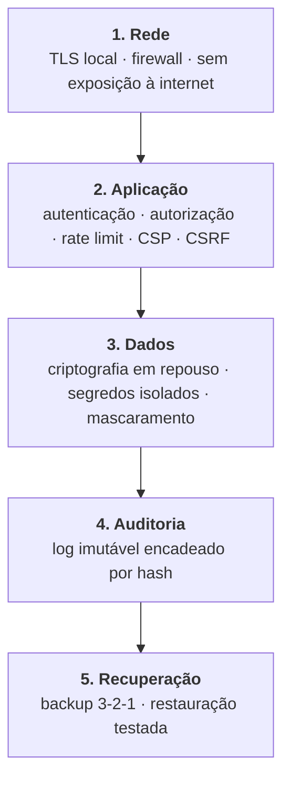

### 7.3 Proteção do certificado digital (crítico)

O certificado A1 é a identidade fiscal da empresa. Comprometido, permite emitir notas em nome dela.

- Armazenado **fora do banco de dados**, em diretório com permissão restrita ao serviço.
- Conteúdo cifrado com **AES-256-GCM**; chave derivada por **Argon2id** a partir de uma senha mestra fornecida na instalação, nunca persistida em texto claro.
- Descriptografado apenas em memória, no momento da assinatura, e descartado em seguida.
- **Nunca** trafega por API, nunca aparece em log, nunca entra no backup em texto claro.
- Monitor de validade alerta em 30, 15, 7 e 1 dia antes do vencimento — certificado vencido para a emissão fiscal da loja.

### 7.4 Criptografia

| Dado | Método |
|---|---|
| Senha de usuário | **Argon2id** (memória 64 MB, 3 iterações) — resistente a GPU |
| Certificado A1 | AES-256-GCM + chave derivada por Argon2id |
| Backups | AES-256-GCM antes de sair da máquina |
| Tráfego na rede local | TLS 1.3, certificado gerado na instalação |
| Tráfego com SEFAZ | TLS mútuo com o certificado A1 |
| Tokens de sessão | Assinados HS256/EdDSA, rotação de chave suportada |

### 7.5 Auditoria imutável

Tabela `auditoria` **append-only**, sem `UPDATE` nem `DELETE` (garantido por trigger). Cada registro contém: quem, o quê, quando, de onde (estação/IP), valor anterior, valor novo, e o **hash do registro anterior** — formando uma cadeia. Adulterar um registro invalida toda a cadeia seguinte, o que torna a manipulação detectável.

**Eventos sempre auditados:** login e falha de login, cancelamento de venda, desconto acima do limite, alteração de preço, ajuste de estoque, sangria/suprimento, abertura/fechamento de caixa, alteração de permissão, exportação de dados, emissão e cancelamento fiscal.

### 7.6 LGPD

| Princípio | Implementação |
|---|---|
| Minimização | CPF no cupom é **opcional**; não coletar o que não se usa |
| Finalidade | Dado de cliente serve à venda e à obrigação fiscal — não a marketing sem consentimento |
| Direito de exclusão | Anonimização do cadastro, **preservando** o documento fiscal (retenção legal de 5 anos prevalece — art. 16, I da LGPD) |
| Portabilidade | Exportação dos dados do titular em formato aberto |
| Segurança | Criptografia, controle de acesso, auditoria |
| Registro de tratamento | Log de quem acessou e exportou dados pessoais |

---

## 8. Estratégia de autenticação

### 8.1 Dois contextos, duas exigências opostas

Este é o ponto onde muitos sistemas erram: aplicam a mesma autenticação no balcão e no escritório.

| Contexto | Necessidade | Consequência de errar |
|---|---|---|
| **PDV, balcão** | Troca de operador em **segundos**, com fila esperando | Senha longa faz a equipe compartilhar login — destrói a auditoria |
| **Retaguarda** | Dados financeiros e fiscais sensíveis | Senha fraca expõe a empresa |

**Solução: dois fatores de rigor diferentes.**

- **PDV:** identificação por **matrícula + PIN numérico (6 dígitos)**, opcionalmente cartão de aproximação. Rápido, e ainda assim individual — cada venda fica atribuída a uma pessoa real.
- **Retaguarda:** senha forte (mínimo 12 caracteres, verificada contra listas de senhas vazadas) + **2FA TOTP obrigatório** para os papéis ADMIN e FINANCEIRO.

O PIN é seguro no contexto porque o ataque exige **presença física** na loja, e é protegido por bloqueio progressivo (5 tentativas → bloqueio de 15 min, registrado em auditoria).

### 8.2 Sessões

```mermaid
sequenceDiagram
    participant U as Usuário
    participant C as Cliente
    participant S as Servidor
    participant D as Banco

    U->>C: matrícula + PIN
    C->>S: POST /auth/login (+ id do dispositivo)
    S->>D: Busca usuário; verifica Argon2id
    alt Credencial válida
        S->>D: Cria sessão (refresh opaco, hash armazenado)
        S-->>C: access token (15 min) + refresh (httpOnly, 12 h)
        Note over S,D: Registra em auditoria: quem, quando, qual estação
    else Inválida
        S->>D: Registra falha; incrementa contador
        S-->>C: 401 (mensagem genérica, sem revelar se o usuário existe)
    end

    loop Enquanto opera
        C->>S: Requisição + access token
        alt Token expirado
            C->>S: POST /auth/refresh
            S->>D: Valida refresh; ROTACIONA
            S-->>C: Novo par de tokens
            Note over S: Reuso de refresh antigo ⇒ revoga TODA a família (detecção de roubo)
        end
    end
```

**Decisões:**
- **Access token JWT curto (15 min)** — sem consulta ao banco a cada requisição.
- **Refresh token opaco e rotativo (12 h)**, armazenado apenas como hash. Rotação com **detecção de reuso**: se um refresh já usado reaparece, foi roubado — revoga a família inteira.
- Cookie `httpOnly`, `Secure`, `SameSite=Strict` — imune a roubo por XSS.
- Sessão vinculada ao **dispositivo**; o administrador vê e encerra sessões remotamente.
- **Sessão do PDV não expira durante caixa aberto** — expirar sessão no meio de uma venda seria um defeito de produto. Renova enquanto há atividade; encerra no fechamento do caixa.

### 8.3 Casos especiais

| Caso | Tratamento |
|---|---|
| Servidor offline (contingência) | PDV valida PIN contra hash replicado localmente; sessão local com validade de 12 h; sincroniza a auditoria ao reconectar |
| Autorização de supervisor | Modal pede credencial do gerente **sem trocar a sessão** — libera a operação pontual e registra ambos os usuários |
| Primeiro acesso | Senha temporária, troca obrigatória; **nunca** existe senha padrão de fábrica |
| Recuperação de senha | Sem e-mail obrigatório neste público: reset presencial pelo ADMIN, registrado em auditoria |
| Bloqueio de tela | Após 5 min ocioso com caixa aberto, exige PIN — protege contra uso por terceiros |

---

## 9. Estratégia de permissões

### 9.1 Modelo: RBAC + escopo + limites por valor

Papel puro não basta para um ERP. "Pode dar desconto" precisa responder **quanto**. O modelo tem três dimensões:

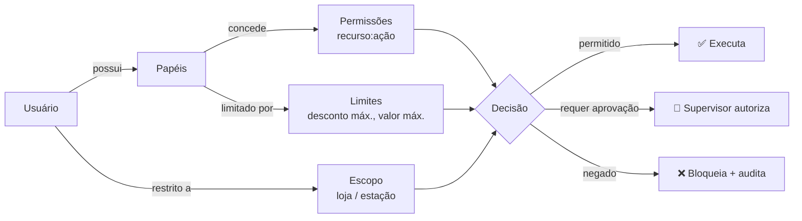

### 9.2 Papéis padrão

| Papel | Finalidade | Não pode |
|---|---|---|
| **OPERADOR_CAIXA** | Vender, consultar preço, abrir/fechar o próprio caixa | Cancelar venda finalizada, alterar preço, ver custo/margem, ver relatórios de outros |
| **SUPERVISOR** | Tudo do caixa + autorizar cancelamentos, descontos maiores, sangria | Alterar cadastro fiscal, ver dados financeiros completos |
| **ESTOQUISTA** | Entradas, ajustes, inventário, cadastro de produto | Vender, ver financeiro |
| **FINANCEIRO** | Contas a pagar/receber, conciliação, relatórios financeiros | Vender, alterar estoque |
| **GERENTE** | Visão completa da loja, relatórios, metas, configurações operacionais | Configuração fiscal crítica, gestão de usuários ADMIN |
| **CONTADOR** | **Somente leitura** fiscal + exportação de XML/SPED | Qualquer escrita |
| **ADMIN** | Configuração total, usuários, fiscal, integrações | — (todas as ações auditadas) |

Papéis são **personalizáveis**: a empresa cria papéis próprios combinando permissões. Os acima são o padrão de fábrica.

### 9.3 Nomenclatura de permissões

Formato `recurso:acao`, com granularidade suficiente para casos reais:

```
venda:criar · venda:cancelar · venda:desconto · venda:desconto_acima_limite
venda:consultar_propria · venda:consultar_todas
produto:criar · produto:editar · produto:alterar_preco · produto:ver_custo
estoque:entrada · estoque:ajuste · estoque:inventario
caixa:abrir · caixa:fechar · caixa:sangria · caixa:reabrir
fiscal:emitir · fiscal:cancelar · fiscal:inutilizar · fiscal:configurar
financeiro:ver · financeiro:lancar · financeiro:conciliar
relatorio:vendas · relatorio:financeiro · relatorio:margem
usuario:criar · usuario:editar_permissoes
config:empresa · config:fiscal · config:backup
```

`produto:ver_custo` merece destaque: em muitas empresas o custo de compra é informação estratégica que o operador de caixa não deve ver. Separar isso de `produto:editar` evita vazamento interno.

### 9.4 Limites por papel

Além do "pode/não pode", cada papel carrega limites numéricos:

| Limite | Operador | Supervisor | Gerente |
|---|---|---|---|
| Desconto máximo em item | 5% | 15% | 30% |
| Desconto máximo na venda | 3% | 10% | 25% |
| Valor máximo de sangria | — | R$ 500 | ilimitado |
| Cancelar venda | não | até 30 min | ilimitado |
| Estorno em dinheiro | — | R$ 200 | ilimitado |

Ultrapassar um limite **não bloqueia a operação**: dispara o fluxo de **autorização de supervisor**, que registra em auditoria quem pediu e quem autorizou. Bloquear puro faz a equipe procurar contorno; autorizar-e-registrar preserva a operação e a rastreabilidade.

### 9.5 Onde a autorização é aplicada

**Sempre no servidor.** A UI esconde o que o usuário não pode fazer — isso é experiência, não segurança. A decisão real acontece no decorador `ComAutorizacao`, que envolve o caso de uso. Um cliente adulterado não contorna nada.

**Negar por padrão:** permissão ausente significa negado. Adicionar funcionalidade nova nunca abre acesso por esquecimento.

---

## 10. Estratégia de backup

### 10.1 A realidade que o backup precisa enfrentar

Pequenas empresas perdem dados por: HD que falha, ransomware, energia, furto do computador, e o clássico "formatei a máquina". O backup precisa sobreviver a **todos** esses, inclusive ao roubo físico do equipamento.

### 10.2 Regra 3-2-1

| Regra | Implementação |
|---|---|
| **3 cópias** | Banco em produção + backup local + backup remoto |
| **2 mídias** | Disco da máquina + pendrive/HD externo ou nuvem |
| **1 fora do local** | Nuvem (S3/Backblaze) ou HD externo levado pelo responsável |

### 10.3 Camadas de proteção

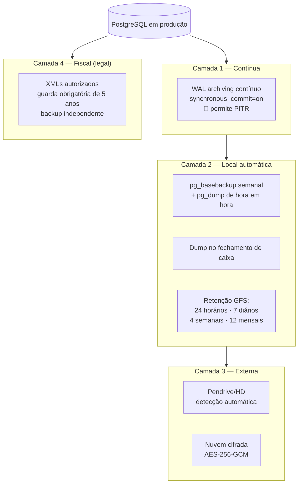

### 10.4 Detalhes que fazem diferença

**Snapshot consistente:** copiar o diretório de dados do Postgres com o serviço no ar produz backup corrompido. Usamos `pg_dump` (lógico, consistente por snapshot MVCC, sem travar a operação) para os backups frequentes e `pg_basebackup` (físico) como base do PITR.

**Point-in-Time Recovery (PITR) — o ganho concreto da mudança para PostgreSQL.** Com o WAL arquivado continuamente, é possível restaurar o banco para **qualquer instante**, não apenas para o último snapshot. Cenário real: às 15h alguém apaga uma tabela de preços por engano; restauramos para 14h59, sem perder as vendas da manhã. Com snapshot horário apenas, perderíamos até 60 minutos de movimento. É isso que derruba o RPO de 15 minutos para **próximo de zero**.

**Backup no fechamento de caixa:** o momento de maior valor do dia. Se algo falhar amanhã, o movimento de hoje está salvo.

**Verificação automática:** todo backup é validado por restauração real em instância temporária (`pg_restore --list` não basta — só a restauração prova) e tem seu hash registrado. Backup que não restaura não é backup — é ilusão de segurança.

**Manutenção do banco (responsabilidade do DBA, automatizada):** `autovacuum` ativo com monitoramento de bloat, `ANALYZE` após cargas grandes, checagem de índices não utilizados e de *bloat* de índice, e alerta de proximidade de *wraparound* de transação. Nada disso é visível ao usuário — roda no `ManutencaoBanco.job`.

**Teste de restauração mensal automatizado:** um job restaura o backup mais recente num diretório temporário, roda verificações de consistência (soma de vendas, saldo de caixa, contagem de documentos fiscais) e relata. Esse é o único jeito de saber que a estratégia funciona *antes* de precisar dela.

**Proteção contra ransomware:** backups em nuvem gravados em bucket com **versionamento e object lock** (WORM). O ransomware criptografa o que está montado localmente; não altera o que já foi gravado como imutável.

**Backup dos XMLs fiscais é separado.** A guarda de 5 anos é obrigação legal independente do banco. Perder o banco é um problema operacional; perder os XMLs é um problema com o Fisco.

### 10.5 Metas de recuperação

| Métrica | Meta | Como se cumpre |
|---|---|---|
| **RPO** (perda máxima) | **próximo de zero** (era 15 min) | 🔑 PITR por WAL archiving contínuo + fila local do PDV |
| **RTO** (tempo de retorno) | 30 min | Restauração por assistente gráfico, sem linha de comando |
| Retenção | 12 meses (dados) / 5 anos (fiscal) | Política GFS + arquivo fiscal separado |

### 10.6 Restauração acessível

O `apps/cli` e um assistente gráfico na retaguarda permitem: listar backups com data/tamanho/integridade, pré-visualizar o conteúdo (quantas vendas, qual período), restaurar com confirmação dupla, e **restaurar para uma cópia** (sem sobrescrever o atual) para conferência antes de efetivar. O usuário-alvo não usa terminal — a restauração precisa ser clicável.

---

## 11. Estratégia de sincronização

### 11.1 O que sincroniza com o quê

| Cenário | Status |
|---|---|
| PDV ↔ servidor da loja (rede local) | **Fase 1** — essencial |
| Loja ↔ nuvem (multi-loja) | Fase 3 — arquitetura preparada |
| ERP ↔ e-commerce/marketplace | Fase 3 — via adapter |

### 11.2 Fundamentos que tornam a sincronização possível

Três decisões tomadas **agora** evitam a reescrita depois:

1. **UUIDv7 como identificador.** Gerado no cliente, sem servidor, sem colisão, e ordenável por tempo (o que preserva a localidade de índice que os IDs sequenciais dão). Auto-incremento tornaria impossível criar venda offline.
2. **Estoque como soma de movimentos.** Ver §11.4 — é o que elimina conflito.
3. **Séries de numeração por estação.** PDV 1 usa série 1, PDV 2 usa série 2. Nunca há disputa por número de documento fiscal.

### 11.3 Padrão Outbox

Toda mudança que precisa ser propagada é gravada **na mesma transação** do dado:

```
BEGIN
  INSERT venda ...
  INSERT venda_itens ...
  INSERT movimento_estoque ...
  INSERT outbox (tipo='VendaFinalizada', payload=..., status='PENDENTE')
COMMIT
```

Isso elimina o problema clássico de "salvou a venda mas perdeu o evento": ou tudo é gravado, ou nada. Um worker lê a outbox e entrega, com retentativa e backoff.

### 11.4 Resolução de conflitos — por tipo de dado

Não existe estratégia única. Cada tipo de dado tem a sua:

| Tipo de dado | Estratégia | Justificativa |
|---|---|---|
| **Venda** | **Sem conflito por construção** | Cada venda tem ID único e uma única origem. Nunca é editada — só criada ou cancelada por novo evento |
| **Movimento de estoque** | **CRDT contador — soma comutativa** | 🔑 O ponto-chave. PDV A vende 3, PDV B vende 2: o saldo é `saldo − 3 − 2`, e **a ordem não importa**. Se o saldo fosse uma coluna sobrescrita, uma das vendas sumiria |
| **Cadastro (produto, cliente)** | Último a escrever vence, com detecção por versão | Edição concorrente do mesmo cadastro é rara; o sistema avisa e mantém histórico |
| **Preço** | Servidor é a autoridade | Preço não se altera no PDV |
| **Documento fiscal** | Série por estação | Impossível colidir |
| **Sessão de caixa** | Dono exclusivo (uma estação) | Só a estação dona escreve |

A escolha de tratar estoque como eventos é a decisão que **elimina** a categoria mais perigosa de conflito num PDV multi-estação — divergência de saldo. Com saldo mutável, sincronização exigiria travas distribuídas ou aceitaria perda de venda.

### 11.5 Protocolo de sincronização

Sincronização **incremental** baseada em relógio lógico (Lamport) + carimbo de tempo:

```
PDV → servidor:  { desde: <cursor>, eventos_locais: [...] }
servidor → PDV:  { eventos: [...], novo_cursor, servidor_hora }
```

- Idempotente: reenviar o mesmo lote não duplica nada (chave de idempotência por evento).
- Retomável: conexão caiu no meio, retoma do cursor.
- Compacta: só o delta trafega.
- **Relógio do servidor é a referência** — máquinas de loja frequentemente têm hora errada, e isso quebraria ordenação e obrigação fiscal.

### 11.6 Preparação para multi-loja (Fase 3)

O mesmo mecanismo escala para nuvem porque já é baseado em eventos com identidade global. O que muda é apenas o destino: em vez de `PDV → servidor da loja`, passa a existir `servidor da loja → hub`. Nenhuma regra de domínio é tocada — é a validação prática de que a arquitetura cumpre a promessa de crescer sem reescrita.

---

## 12. Estratégia para funcionamento offline

### 12.1 Três níveis de degradação

O sistema tem comportamento definido para cada tipo de falha — nenhuma delas para a venda:

| Nível | Situação | O que funciona | O que degrada |
|---|---|---|---|
| **N0 — Normal** | Tudo online | 100% | — |
| **N1 — Sem internet** | Rede local OK, internet fora | Venda, estoque, caixa, relatórios | NFC-e entra em **contingência offline** |
| **N2 — Sem servidor** | Servidor caiu ou rede local fora | **Venda continua** com catálogo replicado | Sem consulta a outras estações; estoque converge depois |
| **N3 — Sem energia** | Queda total | Nada | Nobreak recomendado; WAL + `full_page_writes` garantem recuperação automática ao voltar |

**A distinção N1/N2 é o que a maioria dos sistemas não faz.** Muitos tratam "sem internet" e "sem servidor" como a mesma coisa e param nos dois casos.

### 12.2 O que cada estação mantém localmente

| Dado | Volume | Atualização |
|---|---|---|
| Catálogo (SKU, código de barras, preço, tributação) | ~50k registros | Incremental via SSE; completa na abertura do caixa |
| Hash do PIN dos operadores | dezenas | A cada mudança |
| Configuração fiscal e da loja | — | A cada mudança |
| Últimas 500 vendas da estação | — | Contínua (consulta e reimpressão) |
| **Fila de vendas pendentes** | variável | 🔑 gravada antes de responder ao operador |
| Faixa de numeração fiscal reservada | 1.000 números | Renovada quando restam 200 |

**A reserva antecipada de faixa fiscal** é o detalhe que permite emitir documento em contingência sem servidor: a estação já tem números válidos e exclusivos separados.

### 12.3 Ciclo de vida de uma venda offline

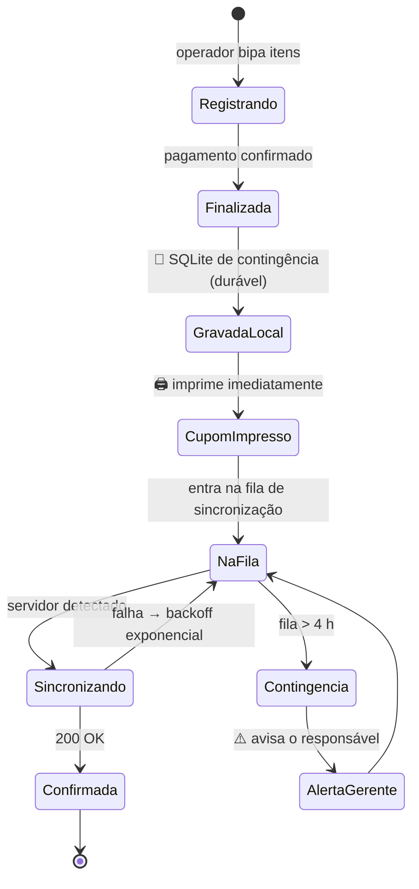

**A venda é considerada concluída assim que grava no disco local.** Não espera servidor, não espera SEFAZ, não espera rede. O operador entrega o cupom e chama o próximo cliente.

### 12.4 Transparência com o operador

Regra de produto: **o operador precisa saber o estado, sem precisar entender de tecnologia.**

- Indicador permanente: 🟢 Conectado · 🟡 Offline (N vendas pendentes) · 🔴 Offline há mais de 4 h
- Nenhum diálogo de erro técnico interrompe a venda. Falhas vão para o log; o caixa só vê o que precisa agir.
- No fechamento de caixa, se houver pendências, o sistema **avisa e explica** — mas não impede o fechamento.
- O gerente recebe alerta na retaguarda quando alguma estação está offline há muito tempo.

### 12.5 Limites honestos do modo offline

Precisa estar documentado, porque prometer offline total seria desonesto:

| Não funciona offline | Por quê | Contorno |
|---|---|---|
| Autorização de cartão (TEF) | Depende da adquirente | Registrar como "a confirmar"; maquininha própria |
| PIX dinâmico com QR | Precisa do banco | PIX estático (chave fixa) funciona |
| Autorização de NFC-e em tempo real | Depende da SEFAZ | Contingência legal (§15.5) |
| Consulta de estoque em outra estação | Sem rede | Mostra o último saldo conhecido, com marca de desatualizado |
| Relatórios consolidados | Dados em outra máquina | Relatórios apenas da própria estação |

---

## 13. Estratégia de atualização

### 13.1 Princípio: atualizar não pode assustar

O público-alvo tem trauma justificado de atualização — "atualizou e parou de funcionar" é história comum. As regras abaixo existem para que atualizar seja um não-evento.

### 13.2 Regras invioláveis

1. **Nunca atualiza com caixa aberto.** O atualizador verifica e adia. Sem exceção.
2. **Nunca atualiza no horário comercial** sem aprovação explícita do gerente.
3. **Backup automático antes de qualquer migração de banco.** Sem exceção.
4. **Toda atualização é reversível** por um caminho testado.
5. **Servidor e estações podem ficar em versões diferentes temporariamente** — a API é retrocompatível dentro da mesma versão maior.

### 13.3 Versionamento

**SemVer** (`MAIOR.MENOR.CORREÇÃO`) com significado operacional claro:

| Incremento | Significado | Ação |
|---|---|---|
| CORREÇÃO (1.4.**2**) | Correção de bug, sem mudança de dados | Automática, silenciosa |
| MENOR (1.**5**.0) | Funcionalidade nova, retrocompatível | Automática, com aviso |
| MAIOR (**2**.0.0) | Mudança incompatível | Manual, com aprovação e comunicado prévio |

Canais: **estável** (padrão), **beta** (clientes voluntários), **crítico** (correção fiscal ou de segurança — instalação imediata, fora do ciclo).

### 13.4 Migração de banco: padrão expand-contract

Migração destrutiva é a principal causa de atualização irreversível. A solução é dividir em três versões:

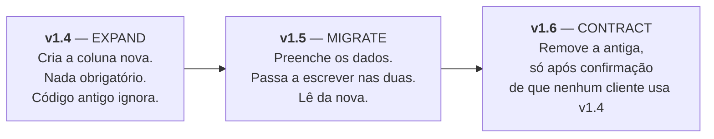

Em qualquer ponto desse caminho é possível voltar para a versão anterior sem perda de dados. Uma migração que apaga coluna na mesma versão que passa a usar a nova torna o rollback impossível — e é assim que atualizações destroem clientes.

**Regras adicionais:** migrations versionadas e sequenciais, sempre com script de reversão testado, executadas em transação (o PostgreSQL tem DDL transacional — uma migração que falha no meio reverte inteira, sem estado intermediário), e validadas contra uma cópia real de banco de produção antes de liberar.

**Cuidados específicos de PostgreSQL em migração** (responsabilidade do DBA):
- `CREATE INDEX CONCURRENTLY` para não bloquear a operação — e, por isso, **fora** de transação
- Evitar `ALTER TABLE ... SET NOT NULL` direto em tabela grande; usar constraint `NOT VALID` seguida de `VALIDATE`
- Adicionar coluna com `DEFAULT` é barato no Postgres 11+, mas **backfill em lote**, nunca num `UPDATE` único
- `lock_timeout` e `statement_timeout` definidos na sessão de migração para não travar o caixa

### 13.5 Fluxo de atualização

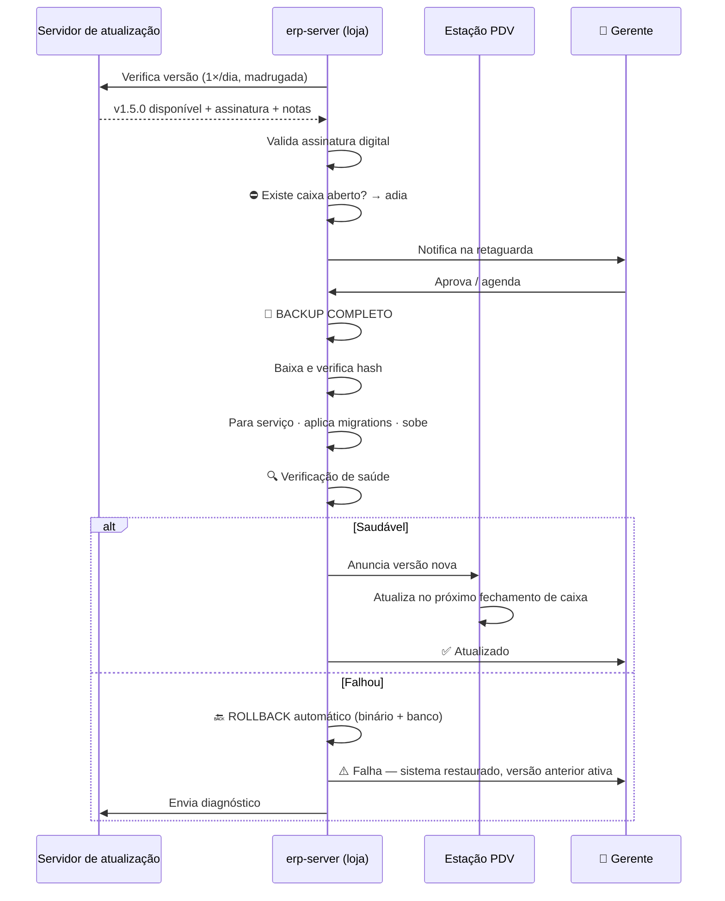

### 13.6 Verificação de saúde pós-atualização

Antes de declarar sucesso, o sistema verifica automaticamente: banco responde e passa em `integrity_check`; contagem de vendas e saldo de caixa idênticos ao pré-atualização; rotas principais respondem; fila fiscal íntegra; certificado acessível. Qualquer falha dispara rollback automático — o cliente não descobre o problema abrindo a loja de manhã.

### 13.7 Segurança da cadeia de atualização

Pacotes assinados com chave privada da empresa; assinatura verificada antes de executar. Download só por HTTPS com pinning. Hash SHA-256 conferido. **Rollback de versão é bloqueado** para impedir ataque de downgrade para uma versão vulnerável conhecida.

---

## 14. Estratégia para impressão

### 14.1 Por que isso é um capítulo, e não uma função

Impressão é a origem número um de chamados de suporte em PDV. As causas são conhecidas: variedade de marcas, drivers ruins, papel de larguras diferentes, impressora em rede que some, e a expectativa de que o cupom saia **instantaneamente**.

### 14.2 Arquitetura da camada de impressão

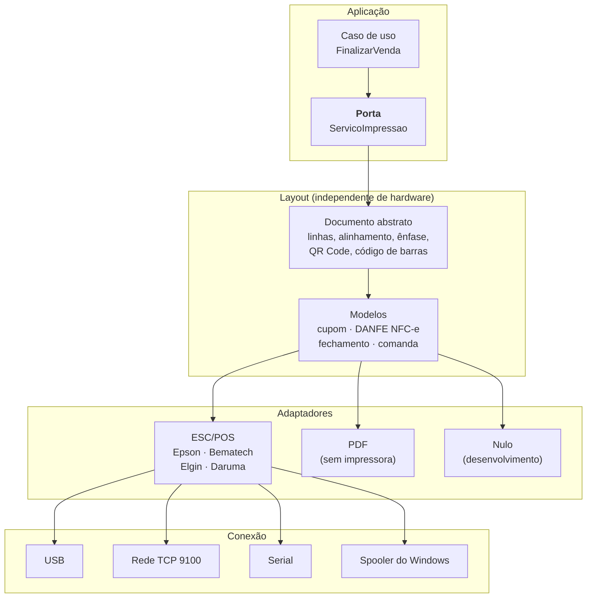

**A separação layout ↔ driver é o que evita retrabalho:** o layout do cupom é escrito uma vez. Trocar de marca de impressora, mudar de 80mm para 58mm ou gerar PDF não altera o layout.

### 14.3 Impressão assíncrona com fila

Impressão **nunca** bloqueia a venda:

1. A venda é finalizada e gravada.
2. O documento entra na fila de impressão.
3. A tela já libera para o próximo cliente.
4. Falhou (sem papel, offline)? Fica na fila e **avisa sem travar**.
5. Reimpressão fica sempre disponível — com marca "REIMPRESSÃO" (exigência fiscal para DANFE).

### 14.4 Compatibilidade

| Aspecto | Estratégia |
|---|---|
| Marcas | ESC/POS é o padrão de fato: Epson, Bematech, Elgin, Daruma, Tanca, Control iD. Perfis por modelo tratam as divergências |
| Largura | 80mm (48 col.) e 58mm (32 col.) — layout recalcula, não é duplicado |
| Conexão | USB (padrão), rede (recomendado para múltiplas estações), serial (legado), spooler do Windows (fallback universal) |
| Descoberta | Detecção automática de USB e varredura da rede na porta 9100; assistente de configuração com **botão de página de teste** |
| Recursos opcionais | Guilhotina, acentuação (CP850/CP858), QR Code nativo vs. imagem — detectados por perfil |

### 14.5 Gaveta de dinheiro

Acionada por comando ESC/POS enviado **através da impressora** (padrão de mercado: conector RJ-11 na impressora). Abre automaticamente em venda com dinheiro ou troco, e sob demanda com permissão `caixa:abrir_gaveta` — **toda abertura manual é auditada**, porque gaveta aberta fora de venda é o vetor clássico de desvio.

### 14.6 Documentos suportados

| Documento | Uso |
|---|---|
| **Cupom não fiscal** | Venda sem emissão fiscal / MVP |
| **DANFE NFC-e** | Representação da nota — layout definido pela SEFAZ, com QR Code, chave de 44 dígitos e mensagem de consulta |
| **DANFE NFC-e em contingência** | Layout específico, com aviso obrigatório |
| **Comprovante de cartão** | Via do cliente e via do estabelecimento |
| **Fechamento de caixa** | Conferência por forma de pagamento, divergências |
| **Etiqueta de prateleira / gôndola** | Preço e código de barras |
| **Comanda de produção** | Impressora secundária (cozinha/balcão) |

### 14.7 Detalhes operacionais que evitam chamado

- **Pré-visualização na tela** antes de configurar a impressora — o cliente vê o cupom mesmo sem hardware.
- **Página de teste** no assistente de configuração — resolve 80% dos "não imprime" no ato da instalação.
- **Impressão em PDF sempre disponível** — o sistema é 100% utilizável antes de a impressora chegar.
- **Código de barras de balança** (EAN-13 iniciado por `2`, com peso ou preço embutido) é interpretado corretamente na leitura — item obrigatório para hortifrúti, açougue e padaria.

---

## 15. Estratégia para emissão fiscal

> ⚠️ **Revisado em 30/07/2026 — ADR-0015 e ADR-0016.**
> O ERP **não implementa comunicação direta com a SEFAZ**. A emissão passa por uma
> **API fiscal externa**, atrás da porta `ProvedorFiscal`, e o módulo fiscal é
> **opcional por empresa**.
>
> O projeto completo — porta, contratos, tela de configuração, custódia do certificado,
> contingência e **análise de custo dos provedores** — está em
> **[`docs/fiscal/ARQUITETURA-FISCAL.md`](fiscal/ARQUITETURA-FISCAL.md)**.
>
> As subseções 15.3 a 15.8 permanecem válidas quanto ao **domínio fiscal** (máquina de
> estados, numeração, tributação, guarda de XML), que continua sendo responsabilidade
> do ERP. O que mudou é **quem fala com a SEFAZ**: o provedor, não nós.

### 15.1 Princípio: o fiscal é um satélite, nunca o núcleo

A legislação fiscal brasileira muda constantemente — e a Reforma Tributária torna isso ainda mais intenso nos próximos anos. Se regra fiscal estiver espalhada pelo PDV, cada nota técnica da SEFAZ vira refatoração de risco.

**Portanto:** todo o fiscal vive atrás da porta `EmissorFiscal`. O caso de uso `FinalizarVenda` não sabe se existe NFC-e, SAT ou nada. Ele publica um evento; o satélite fiscal reage.

### 15.2 Documentos e escopo

| Modelo | Documento | Uso | Fase |
|---|---|---|---|
| — | Cupom não fiscal | Venda simples, desenvolvimento | 1 |
| **65** | **NFC-e** | Varejo presencial a consumidor final | 1 |
| **55** | **NF-e** | B2B, entradas, transferências | 2 |
| **59** | CF-e-SAT | São Paulo (equipamento SAT) | 3 |
| ~~—~~ | ~~NFS-e~~ | ❌ **Fora do escopo** — produto é exclusivamente varejo (`docs/ANALISE-SEGMENTOS.md` §5.1) | — |

### 15.3 Máquina de estados do documento fiscal

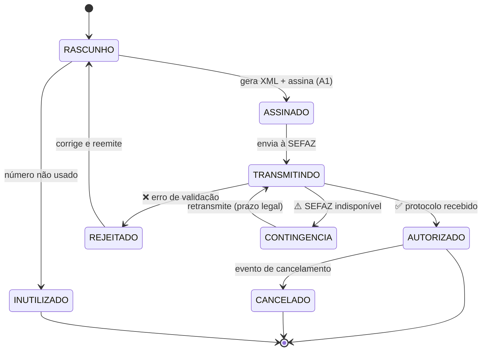

Cada transição é persistida e auditada. Um documento nunca "some" — é possível responder ao Fisco onde está cada número da sequência, o que é exatamente o que uma fiscalização pergunta.

### 15.4 Pipeline de emissão

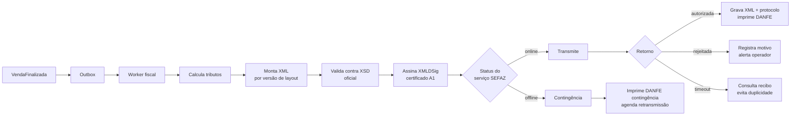

**Validação contra o XSD oficial antes de transmitir** economiza a maior parte das rejeições — falha localmente, em milissegundos, com mensagem clara, em vez de esperar a resposta da SEFAZ.

**Consulta de recibo em caso de timeout** evita o pior erro fiscal possível: transmitir duas vezes a mesma nota porque a resposta se perdeu.

### 15.5 Contingência

Contingência **não é plano B improvisado — é procedimento previsto na legislação**.

| Modo | Quando | Comportamento |
|---|---|---|
| **Offline NFC-e** (`tpEmis=9`) | SEFAZ indisponível | Emite localmente, imprime DANFE em contingência, transmite depois dentro do prazo legal |
| **SVC** (SEFAZ Virtual de Contingência) | SEFAZ da UF fora, ambiente nacional disponível | Redireciona automaticamente |
| **EPEC** | NF-e, casos específicos | Evento prévio de emissão em contingência |

Regras de operação: entrada em contingência é **automática** (monitor de status + circuit breaker); a retransmissão é feita por job dedicado com controle de prazo; o gerente é alertado enquanto houver notas pendentes; e o sistema **impede o fechamento do mês** com pendências fiscais não resolvidas.

> ⚠️ Prazos, obrigatoriedade e janelas de cancelamento **variam por UF** e mudam com frequência. Os valores concretos ficam em tabela de configuração versionada (`packages/fiscal/tabelas/`), **nunca** fixos no código, e devem ser homologados com o contador do cliente.

### 15.6 Motor tributário

Tributação é onde erra-se caro. O motor é uma função pura, exaustivamente testada, que recebe (produto, perfil tributário, regime da empresa, UF origem, UF destino, tipo de operação, tipo de cliente) e devolve a apuração completa.

**Regime da empresa determina o eixo principal:**
- **Simples Nacional** → CSOSN (101, 102, 201, 202, 203, 300, 400, 500, 900)
- **Lucro Presumido / Real** → CST ICMS (00, 10, 20, 40, 41, 50, 51, 60, 70, 90)

**Tributos tratados:** ICMS, ICMS-ST, FCP, DIFAL, IPI, PIS, COFINS — e os novos da Reforma (§15.7).

**Classificação por produto:** NCM (8 dígitos), CEST (7 dígitos, quando sujeito a ST), CFOP (por operação), origem da mercadoria (0–8).

**Perfil tributário** agrupa a tributação e é reaproveitado entre produtos. Cadastrar 5.000 produtos definindo tributação individualmente é inviável na prática; perfis tornam isso administrável.

### 15.7 Reforma Tributária — preparação obrigatória

Estamos em 2026, o **ano de teste** da CBS e do IBS. As notas técnicas já introduziram os grupos correspondentes no layout da NF-e/NFC-e. Ignorar isso hoje garante uma reescrita fiscal em 2027.

| Tributo | O que é | Situação |
|---|---|---|
| **CBS** | Contribuição sobre Bens e Serviços (federal — substitui PIS/COFINS) | Em teste em 2026, plena a partir de 2027 |
| **IBS** | Imposto sobre Bens e Serviços (estadual/municipal — substitui ICMS/ISS) | Teste em 2026; transição gradual até 2033 |
| **IS** | Imposto Seletivo | Produtos específicos |

**Consequências de projeto, aplicadas desde agora:**
- O modelo de dados de tributação **já contempla** os grupos IBS/CBS/IS, ainda que zerados.
- O motor tributário é versionado **por competência** (ano/mês): a mesma nota reemitida referente a período anterior calcula com as regras daquele período.
- Durante a transição haverá **coexistência** de ICMS/ISS com IBS/CBS. O motor precisa apurar ambos simultaneamente — e por isso não pode assumir um único conjunto de tributos.
- Tabelas e alíquotas ficam em arquivos de configuração versionados, atualizáveis sem nova versão do sistema.

### 15.8 Guarda e obrigações acessórias

XMLs autorizados e cancelados são armazenados em disco (`ano/mês`), com backup independente e retenção de **5 anos** — obrigação legal. A exportação para o contador gera pacote por período (XMLs + relatório), e o papel `CONTADOR` tem acesso somente leitura a isso. SPED Fiscal, EFD Contribuições e demais obrigações entram na Fase 3, reaproveitando os mesmos dados.

---

## 16. Estratégia para crescimento futuro

### 16.1 Os quatro eixos de crescimento

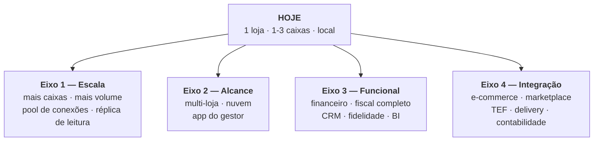

### 16.2 Como cada eixo é atendido sem reescrita

| Eixo | Mudança necessária | O que **não** muda |
|---|---|---|
| **Mais volume / mais caixas** | Pool de conexões (PgBouncer) e réplica de leitura para relatórios | Domínio, casos de uso, API, UI |
| **Postgres local → nuvem** | String de conexão | Absolutamente nada mais — 🔑 ganho direto da decisão de banco único |
| **Multi-loja** | Novo adapter de sincronização; `lojaId` já existe no modelo | Regras de venda, estoque, fiscal |
| **App mobile do gestor** | Novo adapter de entrada consumindo a mesma API | Toda a lógica de negócio |
| **Novo documento fiscal (SAT-CF-e)** | Novo adapter `EmissorFiscal` | PDV, venda, estoque |
| **TEF / maquininha** | Novo adapter `ProvedorPagamento` | Fluxo de venda |
| **E-commerce / marketplace** | Adapter de integração + ACL | Catálogo e estoque |
| **Módulo financeiro** | Novo contexto no domínio, reagindo a `VendaFinalizada` | Contextos existentes |
| **Balança / autoatendimento** | Novo adapter de hardware | Domínio |

Essa tabela **é** a justificativa econômica da arquitetura hexagonal. Cada linha representa um pedido comercial provável, e em nenhuma delas o núcleo é tocado.

### 16.3 Modularização por assinatura

O modelo comercial provável é venda por módulos. A estrutura já permite: cada módulo é um contexto delimitado com casos de uso próprios, ativado por licença. Um cliente que não contrata Financeiro simplesmente não tem esses casos de uso registrados no container — sem código morto na tela, sem `if` de licença espalhado.

### 16.4 Multi-tenancy — decisão consciente adiada

Multi-tenancy é a decisão mais cara de adicionar depois **se o modelo de dados não estiver preparado**. A preparação mínima adotada agora:

- `empresaId` e `lojaId` presentes no modelo desde o início (mesmo com valor único).
- Repositórios recebem contexto de tenant, ainda que hoje seja constante.
- IDs globalmente únicos (UUIDv7) — merge de bases é possível.

Com isso, migrar para SaaS multi-tenant no futuro é adicionar filtro e isolamento, não remodelar o banco. **Não** se implementa isolamento completo agora: seria complexidade sem uso, violando o princípio 6.

### 16.5 Observabilidade — preparada, não implementada

Logs estruturados (Pino) com **ID de correlação** atravessando PDV → servidor → SEFAZ desde a Fase 1. Isso é barato agora e é o que permite, na Fase 3, plugar métricas e rastreamento distribuído sem instrumentar o código de novo. Telemetria de produto (funcionalidades usadas, erros) é opt-in e anonimizada, respeitando a LGPD.

### 16.6 O que **não** será feito (e por quê)

| Tentação | Por que é errado agora |
|---|---|
| Microsserviços | Custo operacional imenso para 3 máquinas |
| Kubernetes | Não há o que orquestrar |
| Cloud-first | Viola o princípio 1 |
| Multi-tenancy completo | Complexidade sem cliente que a pague |
| Plugins de terceiros | Superfície de segurança e suporte antes de haver ecossistema |
| Reescrever em Rust/Go por desempenho | O gargalo é humano e de I/O, não de CPU |

Disciplina em recusar complexidade prematura é o que preserva a velocidade de entrega. A arquitetura acima torna cada um desses itens **possível** no dia em que houver justificativa — que é exatamente o objetivo.

---

## 17. Roadmap de implementação

Sequência proposta, com fronteiras claras entre entregas:

| Etapa | Entrega | Depende de |
|---|---|---|
| **0** | Fundação: monorepo, pnpm/Turborepo, CI, regras de arquitetura, design system base, **PostgreSQL em Docker para desenvolvimento** (mesma versão da produção) | — |
| **1** | `@erp/domain` — objetos de valor (`Dinheiro`, `CPF`, `NCM`), agregados e testes unitários | 0 |
| **2** | `@erp/database` — schema Prisma, migrations, repositórios | 1 |
| **3** | Autenticação, papéis e permissões ponta a ponta | 2 |
| **4** | Cadastros (produto, categoria, cliente, fornecedor) + retaguarda | 3 |
| **5** | Estoque com movimentos e projeção de saldo | 4 |
| **6** | **PDV** — carrinho, atalhos, pagamento, fechamento de venda | 5 |
| **7** | Caixa — abertura, sangria, suprimento, fechamento com conferência | 6 |
| **8** | Impressão — ESC/POS, cupom, fechamento | 7 |
| **9** | Fiscal — `ProvedorFiscalNulo` → `ProvedorFiscalFalso` → adapter do provedor escolhido → homologação → produção | 7 |
| **10** | Offline e sincronização — réplica local, fila, contingência | 6, 9 |
| **11** | Backup (PITR), atualização e **instalador com PostgreSQL embarcado** — autoconfiguração como serviço do Windows | todas |
| **12** | Relatórios e dashboard | 7 |

**Marco comercial (MVP vendável):** conclusão da etapa 11.

---

## 18. Registro de decisões arquiteturais (ADR)

As decisões deste documento serão registradas individualmente em `docs/adr/`, no formato: contexto → decisão → alternativas → consequências → status. ADRs são **imutáveis**: uma decisão revista gera um novo ADR que supersede o anterior, preservando o histórico do raciocínio.

| ADR | Decisão | Seção |
|---|---|---|
| 0001 | Servidor local com contingência no cliente | §2.2 |
| ~~0002~~ | ~~SQLite como banco padrão~~ — **superseado pelo ADR-0013** | §5.2.1 |
| 0003 | Monorepo com pnpm + Turborepo | §3 |
| 0004 | Arquitetura hexagonal com domínio puro | §2.3 |
| 0005 | Electron no PDV, web na retaguarda | §5.2.2 |
| 0006 | Emissão fiscal assíncrona via Outbox | §2.4, §15 |
| 0007 | Estoque como eventos comutativos | §11.4 |
| 0008 | UUIDv7 como identificador | §11.2 |
| 0009 | Dinheiro em centavos (`bigint`) | §6.3 |
| 0010 | Domínio nomeado em português | §4.7 |
| 0011 | Autenticação diferenciada: PIN no PDV, senha + 2FA na retaguarda | §8.1 |
| 0012 | Migrações no padrão expand-contract | §13.4 |
| **0013** | **PostgreSQL único embarcado no instalador** (supersede o 0002) | §5.2.1 |
| **0014** | Escopo restrito a varejo; prestação de serviços fora do produto | `ANALISE-SEGMENTOS.md` §5.1 |
| **0015** | **Emissão fiscal via provedor externo, atrás de abstração própria** | `fiscal/ARQUITETURA-FISCAL.md` |
| **0016** | **Módulo fiscal opcional, habilitado por empresa** | `fiscal/ARQUITETURA-FISCAL.md` §4 |

---

## 19. Glossário

| Termo | Significado |
|---|---|
| **Agregado** | Conjunto de objetos tratado como unidade de consistência transacional |
| **CBS / IBS / IS** | Tributos da Reforma Tributária (substituem PIS/COFINS e ICMS/ISS) |
| **CFOP** | Código Fiscal de Operações e Prestações |
| **CRDT** | Estrutura de dados que converge sem conflito, independente da ordem de aplicação |
| **CSC** | Código de Segurança do Contribuinte — usado no QR Code da NFC-e |
| **CSOSN / CST** | Códigos de situação tributária (Simples Nacional / regime normal) |
| **DANFE** | Documento Auxiliar da Nota Fiscal Eletrônica (a via impressa) |
| **ESC/POS** | Linguagem de comandos padrão de impressoras térmicas |
| **Expand-contract** | Migração em etapas que preserva a possibilidade de rollback |
| **NCM / CEST** | Códigos de classificação de mercadoria |
| **NFC-e** | Nota Fiscal de Consumidor Eletrônica (modelo 65) |
| **Outbox** | Tabela de eventos gravada na mesma transação do dado, garantindo entrega |
| **Porta / Adapter** | Interface definida pelo domínio / sua implementação concreta |
| **RPO / RTO** | Perda máxima de dados aceitável / tempo máximo de recuperação |
| **Sangria** | Retirada de dinheiro do caixa durante o expediente |
| **SAT** | Equipamento fiscal usado em São Paulo (CF-e, modelo 59) |
| **MVCC** | Controle de concorrência do PostgreSQL: leitores não bloqueiam escritores nem vice-versa |
| **PITR** | Point-in-Time Recovery — restauração do banco para qualquer instante, via WAL arquivado |
| **WAL** | Write-Ahead Logging — log de escrita que garante durabilidade e viabiliza PITR |

---

## Próximos passos

Este documento requer **aprovação** antes de qualquer implementação. Pontos que pedem decisão explícita:

1. ~~Confirmar o banco de dados~~ — ✅ **decidido**: PostgreSQL único embarcado (ADR-0013, §5.2.1).
2. **Confirmar Electron no PDV** (§5.2.2) — define se haverá suporte a hardware fiscal.
3. **Confirmar o escopo da Fase 1** (§1.4) e o marco de MVP (§17).
4. **Definir o modelo comercial** (licença única, assinatura, por módulo) — influencia §16.3.
5. **Validar as regras fiscais com um contador** antes da etapa 9 — nenhuma tabela fiscal deve ir a produção sem essa validação.

Aprovado o documento, a implementação começa pela **Etapa 0** do roadmap.
